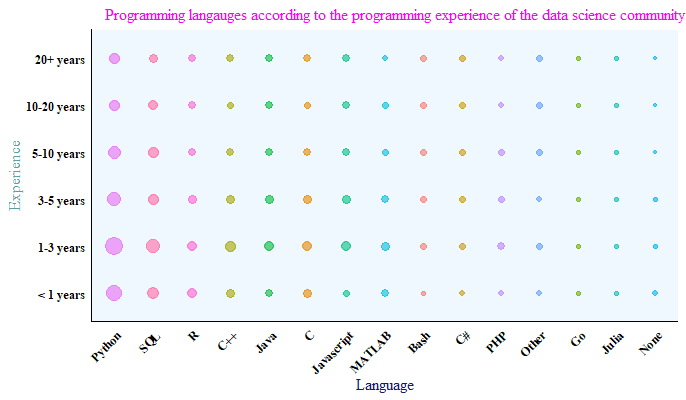
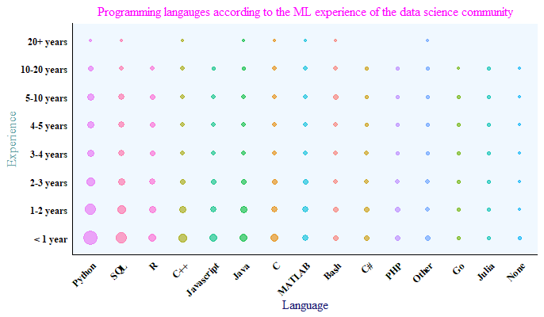
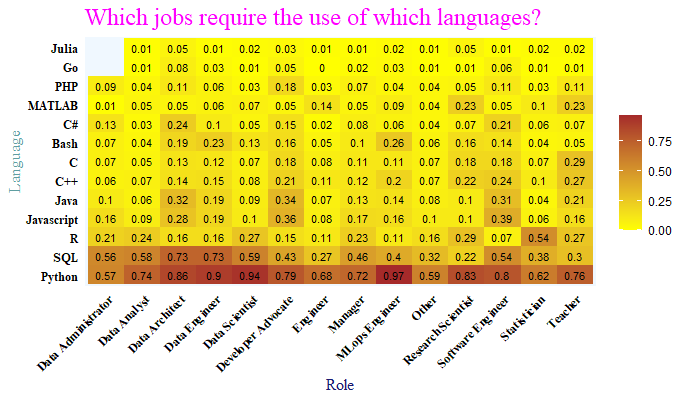
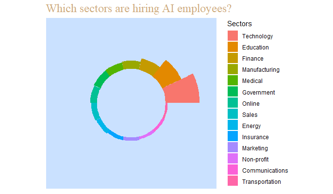
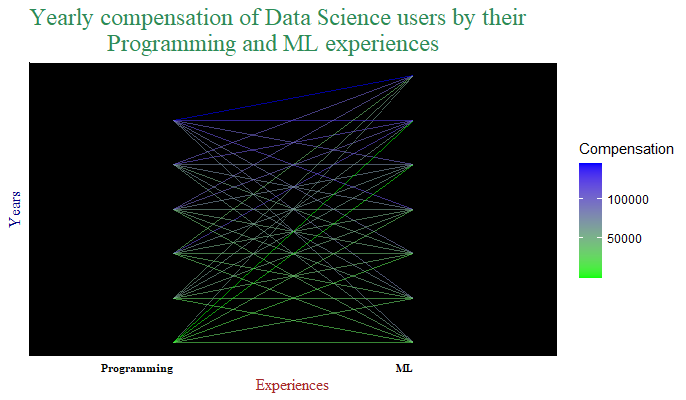
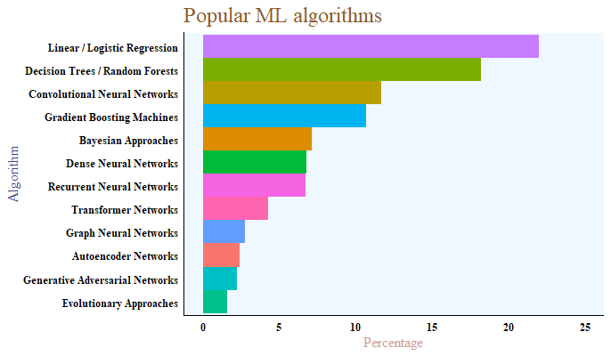
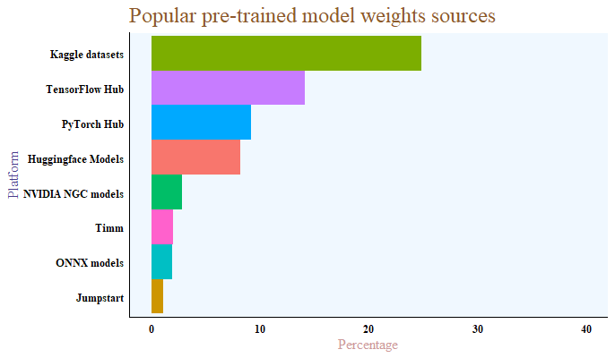

```{r setup, include=FALSE}
knitr::opts_chunk$set(echo = FALSE)
```

## Introduction

<br><br> The field of data science and machine learning has been continuously growing in stature thanks to its adoption by different sectors in the world. And, why not? After all, adopting machine learning techniques helps increase the efficiency achieved in performing most of the tasks. Going ahead, it is the most popular field in terms of its applications in the real world. Hence, lots of jobs also do require at least some degree of knowledge or understanding in this field, otherwise you won't be really going far. The world is moving forward in the approach of applied machine learning, so it's better for us to adapt to survive this change as well. <br><br>

## Target

<br><br> As a beginner in this field, it is extremely important to know the ongoing trends in the market to know where the world is headed so as to be able to make a smart choice and be optimal with regards to their approach. It is also important for market strategists to know the ongoing trends so that they can carefully devise their strategy around the target audience for maximum benefits. So this project is aimed at answering those questions for both the beginners as well as the strategists. Being not very experienced in this field myself also encouraged me to work on this project to discover what's going on in this field and despite all the work, I really enjoyed doing this project and the insights gained were absolutely worth it. So strap on and get ready to explore the trends in the market of machine learning! <br><br>

## Users

<br><br> The first question that comes to the mind is: who are the ones that are applying data science and machine learning? Their attributes: like whether they are still learning, what's their age, what countries have adapted to it's usage and which ones are lagging behind, etc. <br> <br>


<br> <br> As shown in the above graph, there is an almost identical proportion of users that are student as well as those that are not students. Part of that could be due to the fact that data science and machine learning is a vast field which continues to grow in popularity and so most users are either still new or are still learning it. <br> <br>


<br> <br> As you can see above, however, that there is no such even distribution between users when it comes to their gender, with the males dominating the field with over three quarters of the users being men. It is understandable for the male proportion to be high as they are the more dominant sex in terms of both population and especially employment but still over three quarters is pretty high. <br> <br>


<br><br> However, the above chart shows an interesting trend among the data science users. The gender wise distribution of students in the community shows that while there is an almost even distribution of students in most of the category, about 55 % of the female users are still students while for their male counterparts the same measure drops to 45 % in contrast to the overall 50 %. The difference is slight but it does tell a story. <br> <br>

```{r echo=FALSE, message=FALSE, warning=FALSE}
library(ggplot2)
library(ggrepel)
library(plotly)
library(RColorBrewer)

source("User_Data_Wrangling.R")

p <-  world_data %>%
                ggplot() +
                geom_sf(aes(fill = Users)) +
                labs(title = "How much popular is data science across the globe?") +
                theme_minimal() +
                scale_fill_distiller(palette = "RdYlGn", na.value = "white") +
                theme(panel.background = element_rect(fill = "dodgerblue",  color = "white"),
                      panel.grid.major = element_blank(),
                      panel.grid.minor = element_blank(),
                      axis.line = element_line(color = "black"),
                      plot.title = element_text(color = "darksalmon",
                                                size = 18, family = "serif"),
                      axis.text = element_text(color =  "black", face = "bold", family = "serif"))
    
          ggplotly(p)
```

<br> <br> There is an even more interesting underlying fact when it comes to analyzing the nationality of the users.

-   As shown in the above map, India has the highest number of users with it lying far ahead of the second placed USA but that is to be expected of the country with the second largest population in the world.

-   The real surprise here is China with its users forming a mere 2 % of the whole data science and machine learning community. However, that could be due to the fact that not many people from China may have partook in the survey leading to these results. But one thing is pretty certain, that the biggest market for this field lies in India. <br> <br>


<br><br> There are no real surprises when it comes to the age of the users though, with the 18-29 age group category populating the most of the community and the number of users just continues to drop with increase in age from there on. One key reason for this could be the fact that the field has picked strength mostly over the past couple of decades and so most of its users are still not that old. <br> <br>

## Platforms

<br><br> Another interesting question that rises is that how do these users learn? I mean, which methods do they use to study and which are the platforms where these users like to study and interact.

-   The first one of these questions is answered below where we can see that Coursera is by far the most popular and leading resource platform to study data science and machine learning.

-   We can also see that despite the recent increase in e-learning, university courses haven't lost all of their charm and continue to be a popular choice.

-   They are closely followed by Kaggle and Udemy with the rest of the platforms trailing behind.<br><br>


<br><br> But is that it? Is popularity all that it's about? Afraid not. As you can see below:

-   Kaggle makes a really strong case for itself when it comes to helpful resource platforms. Despite all the online courses for all the platforms being grouped together, they lead Kaggle by only 2 %.

-   We can also see an interesting trend here that video platforms like YouTube are pretty helpful according to our users.

-   Another noticeable fact is that people find data science threads on reddit and other platforms like it pretty useful as well.<br><br>

 <br><br>

## Education

<br><br> It is always a unanswered question that keeps popping up constantly in a beginner's mind: how much do I need to study to be a good enough data scientist or machine learning engineer or data analyst, etc. With the field being as vast as it is, it is virtually impossible to study everything, of course. So let's look at what is the level of education that our current users have received. <br><br>

 <br><br>

-   As shown above, most of the users have either completed either a Master's or a Bachelor's degree, with Master's being the more popular choice of the two.

-   Some even go as far as a Doctoral degree but very few people study beyond that.

-   One clear conclusion here is that a Bachelor's degree is the minimum level of education that most of the users have received. <br><br>


<br><br> Now here comes the interesting part, how much study do you need for your favorite job in the field?

-   As the above chart depicts, most people with a Bachelor's degree end up as Data analysts with their second most popular choice being Data scientists. A good proportion of them are also currently not employed though(ouch!) and I personally hope that it's because they are looking for higher studies and nothing more.

-   As with the proportions with the Data analysts and Data scientists, the converse holds true for those with a Master's.

-   The ones with a Doctoral or Professional doctorate mostly end up as Research scientists, Professors or Data scientists.

-   A word to the wise here, the ratio of unemployment is significantly high among those with a high school degree, some study or unmentioned study, so try to get some substantial level of formal education before diving into this field citing its increased popularity as the reason behind your thinking of higher employment chances. <br><br>


<br><br> Next, we'll look at the types of research done by the users and we see that the proportion of users to have done at least some level of research hovers around 75 % for each of Master's, Doctoral and Professional doctorate with the proportion increasing a little for each field respectively. We can also notice that applied research is the more popular choice over theoretical research for all the cases. <br><br>

## Programming

<br><br> Now another major question: which language should I learn? Fortunately the answer is pretty straightforward:

-   When it comes to programming languages, no other language is used in the data science and machine learning fields as much as Python with it's popularity almost double of the second best SQL.

-   SQL is the second most popular language, this popularity itself dismisses any notion of it being out-dated and people moving on from it.

-   R is the third most popular language, but as you may see later on here, it does have its uses.

-   R is closely followed by the performance built C++, with the rest of the languages following suit. <br><br>

 <br><br>

-   And since Python is the most popular language, it comes to no surprise that the most popular IDEs and Notebook environments is crowded by primarily Python supporting IDEs.

-   The likes of Jupyter notebook, PyCharm and Jupyter labs are among the top 4 environments with the multi-language supporting VSCode being the other entrant among the top 4.

-   We can also see that RStudio's has fallen down the pecking order despite having pretty good features. One key reason behind that is the fact that R is not that popular a language and also that RStudio doesn't does much of the advertisements, this hurting it's popularity. <br><br>

 <br><br>

 <br><br>

-   When it comes to the experience of the users, we can see that most of the trends are as expected with Python, SQL and R being the most popular languages but there are a few exceptions.

-   We see that for beginners in programming as well as ML, Python, SQL and R are the most popular languages, but the other languages like C++, C, Java are also known to a considerate proportion of the newcomers suggesting there adopting with change and learning more skills to add more depth to their skills.

-   We can also observe that most people prefer to start their ML journey with either Python or SQL. The rest of the patterns are as expected. <br><br>

 <br><br>


<br><br> When we look at the job-wise analysis of the programming languages, one fact is clear as day: Python is the undisputed most popular language when it comes to data science and machine learning, across all roles. I mean, it is the most used language across all roles and that too despite some languages being specialized for some jobs. Like R comes into its own for statisticians and SQL is popular among data architects, data engineers and data administrators. But Python still outlasts them even in these jobs. Still, Python is a bit too popular among Data scientists and MLOps engineers. Java and JavaScript are used by Software engineers. <br><br>

 <br><br>

## State of Machine Learning

<br><br> Machine learning (ML) adoption is rapidly transforming industries by enhancing operational efficiency, driving innovation, and enabling data-driven decision-making. Businesses across various sectors are leveraging ML for predictive analytics, automation, and personalized customer experiences. The integration of ML is facilitated by increased investment, the rise of cloud-based ML solutions, and the availability of powerful open-source tools. Despite challenges such as data privacy concerns and the need for skilled talent, the overall trend indicates a significant and growing reliance on ML technologies to maintain competitive advantages and address complex business problems. <br><br>


<br><br> The data shows that about about 40% of respondents say that their organizations have Machine Learning models in production, either in an advanced stage or in an intermediate stage (they recently started using ML methods), while a percentage of 12.4% uses ML methods for generating insights. However, a considerable percentage of the participants, 26.7% to be accurate, answered that their companies haven't started yet using AI and ML techniques while 20.9% of the respondents say that they have started exploring the capabilities of this new technology. <br><br>

```{r, message=FALSE, warning=FALSE, echo = FALSE}
library(ggplot2)
library(forcats)
library(plotly)

source("ML_State_Wrangling.R")

plot_ly(type = "funnelarea",
              text = data2$Selected,
              values = data2$Percentage) %>%
        layout(title = list(text = "Activities performed at job",
        font = list(family = "serif", size = 18, color = "chocolate4")))
```

<br><br>

-   So, 29.7% of the total activities that the respondents do is Analyze and understand data to influence product or business decisions. Data analysis dominates Data Scientists and Data Analysts' activities as is also illustrated in the following visualizations. The main task of those two roles is to analyze data to identify patterns and trends and extracts actionable insights for driving business decisions.

-   The second most common activity is building prototypes for machine learning models.

-   One more common activity is to Build and run data infrastructure where all 4 roles contribute almost equally.

-   In the fourth and fifth positions are the Experimentation and iteration to improve existing ML models and Build a machine learning service. Perhaps is not a surprise that Machine Learning Engineers are mainly responsible for these activities.

-   Last but not least, is to performing research that advances the state of the art of machine learning which as it's expected undertaken mostly by Research Scientists. <br><br>

 <br><br>

Here are a few key points from the above chart:

-   The finance sector hires more for the purpose of analyzing data and building data infrastructure due to their need of analyzing trends and patterns within data and storing high volumes of big data.

-   The education sector is responsible for hiring a good proportion of machine learning researchers.

-   One last key point is that even though analyzing data is a beginner level role, most sectors do require it from time to time. <br><br>


<br><br> When it comes to the company size and the size of their data science team, it is fairly obvious( and reasonable) that the size of a data science team grows with its company size. <br><br>

```{r, message=FALSE, warning=FALSE, echo = FALSE}
library(ggplot2)
library(forcats)
library(plotly)

source("ML_State_Wrangling.R")

plot_ly(type = "scatterpolar", fill = "toself", mode = "marker") %>%
        add_trace(r = pivot_d1[, 1], theta = rownames(pivot_d1), name = colnames(pivot_d1)[1])  %>%
        add_trace(r = pivot_d1[, 2], theta = rownames(pivot_d1), name = colnames(pivot_d1)[2])  %>%
        add_trace(r = pivot_d1[, 3], theta = rownames(pivot_d1), name = colnames(pivot_d1)[3])  %>%
        add_trace(r = pivot_d1[, 4], theta = rownames(pivot_d1), name = colnames(pivot_d1)[4])  %>%
        add_trace(r = pivot_d1[, 5], theta = rownames(pivot_d1), name = colnames(pivot_d1)[5])  %>%
        add_trace(r = pivot_d1[, 6], theta = rownames(pivot_d1), name = colnames(pivot_d1)[6]) %>%
        layout(polar = list(radiaxis = list(visible = T, range = c(0, 50))),
               title = list(text = "How many people for a ML activity?",
                            font = list(family = "serif", size = 18, color = "chocolate4"),
                x = 0.5, xanchor = "center"))
```

<br><br>

```{r, message=FALSE, warning=FALSE, echo = FALSE}
library(ggplot2)
library(forcats)
library(plotly)

source("ML_State_Wrangling.R")

plot_ly(data6, x = ~Q27, y = ~Q25, z = ~Q26, type = 'scatter3d') %>%
      layout(scene = list(xaxis = list(title = "ML state"),
                yaxis = list(title = "Company size"),
                zaxis = list(title = "ML team size")))
```

<br><br>

## Employment

<br><br> The data science and machine learning (ML) industry has seen rapid growth and increasing demand for skilled professionals. Employment opportunities are diverse, spanning roles like data scientists, ML engineers, data analysts, and AI researchers. Companies across various industries---such as tech, finance, healthcare, and retail---are investing heavily in data-driven decision-making and automation. The demand for expertise in areas like big data, predictive analytics, and AI-driven solutions is high, driven by the need to gain competitive advantages and improve operational efficiency. Additionally, the evolving landscape of tools and technologies requires continuous learning and adaptation, making the field dynamic and constantly evolving. <br><br>


<br><br> The above chart shows the percentage of users in each job in the data science community and there are a couple of key points that we can notice:

-   Data scientist is the most popular choice for a job, potential reasons behind which can be due to the fact that they gain high salaries and hold respectable positions within their companies.

-   Data analysts are the second choice, ranked behind data scientist. A key reason behind this could be that many users do start out as data analyst but transition over into other jobs( as you will later see).

-   A substantial proportion of manager level jobs comes as a surprise at first but can be credited to the larger size of data science teams on projects which need to be coordinated with discipline.



<br><br> When it comes to which sectors are hiring these employees:

-   It comes to no surprise that the technology sector is well ahead of the rest in hiring of employees from this community.

-   Education sector comes second which suggests that a high number of teachers and professors related to the field are also hired.

-   Next is the finance sector which again makes sense as this sector needs people to do predictions and manage large volume real-time data and who better than the people with an expertise in those two domains.

-   It is unfortunate that the government sector is still behind in adopting the latest technology which can be seen here with their not so satisfactory performance. <br><br>


<br><br> The above chart represents the sector-wise analysis of the jobs and here we can see that:

-   The need for data scientists and data analysts is spread uniformly across each sector.

-   Along expected lines, software engineers are in demand in the technology sector as well as teachers are employed mostly in the education sector.

-   Engineers are hired mostly in the energy and manufacturing sectors.

-   The government employs a good proportion of statisticians so if you are a statistician your chances at a government job might just get a boost. <br><br>


<br><br> There are two key points when comparing the jobs with the machine learning experiences of the users:

-   Most people do not necessarily start out as data scientists, research scientists and MLops engineer but as their career progresses they transition into one.

-   The converse is true about data analysts, data engineers and software engineers, with many people starting out in these jobs but transitioning into other roles with time. <br><br>

```{r, message=FALSE, warning=FALSE, echo= FALSE}
library(ggplot2)
library(forcats)
library(plotly)

source("Employments_Wrangling.R")

p <- data5 %>%
        ggplot(aes(x = Earnings, y = Expenses, color = Role)) +
        geom_point() +
        labs(title = "How much of their earnings do they spend on ML?",
             x = "Earnings", y = "ML expenditure", fill = "") +
        theme_minimal() +
        theme(legend.position = "none",
              panel.background = element_rect(fill = "lightsteelblue1", color = "white"),
              panel.grid.major = element_blank(),
              panel.grid.minor = element_blank(),
              axis.line = element_line(color = "black"),
              plot.title = element_text(color = "burlywood3", size = 18, family = "serif"),
              axis.title.y = element_text(color = "violet", size = 12, family = "serif"),
              axis.title.x = element_text(color = "firebrick2", size = 12, family = "serif"),
              axis.text = element_text(color =  "black", face = "bold", family = "serif"),
              axis.text.x = element_text(angle = 45, hjust = 1))
      
      ggplotly(p)
```

<br><br>

```{r, message=FALSE, warning=FALSE, echo = FALSE}
library(ggplot2)
library(forcats)
library(plotly)

source("Employments_Wrangling.R")

plot_ly(type = "sankey", orientation = "h",
              link = list(source = data6$source_index, target = data6$target_index, value = data6$Count),
              node = list(pad = 15, thickness = 20, line = list(color = "black", width = 0.5),
                          label = node_labels))
```

<br><br>

## Earnings

<br><br> Now, time for the million-dollar question that everyone has been waiting for: how much does it pay? Is the payment good enough? Which roles and what sectors pay the most? Well the answer to that it surely not a million-dollar but as you would see, it pays just fine. So let's jump in and see if doing all of this is worth the effort(in dollars) or not? <br><br>


<br><br>

-   At first glance it looks like that the payment is not that fancy, and it's not for most of the job.

-   But for some jobs like data scientists and MLOps engineers it's fine but the highest paying jobs are that of a manager and data architects, which is understandable as these are high level jobs that require much experience at the top level and where the employee organizes a team to work instead of doing just their work.

-   Another noteworthy point is the low salaries of teachers and professors. <br><br>


<br><br>

-   A look at the sector-wise inspection of payments tells us that the Insurance and the Medical sectors are the highest paying sectors.

-   There are good payments in the finance, online, technology and communication sectors as well.

-   The earnings of those in the academic sector are low which is not surprising given the low salaries of teachers and professors observed in the last section. <br><br>


<br><br>

-   Talking about academics and education, seems like that the fact that higher education pays more holds true in this case.

-   And the same can be said about the company size, where a bigger company can afford higher salaries to its employees. <br><br>


<br><br> There is much more interesting data when we come to analyzing the payment across continents though:

-   Americas are clearly the highest paying continent where the development of North America must have papered over the cracks of South America.

-   Surprisingly though, Oceania is the 2nd most paying continent and Europe is quite below that. One potential reason behind which could be the fact that Oceania doesn't comprises of too many countries which aren't that behind in terms of technology, giving it a higher median salary.

-   It is clearly evident that being employed in this sectors in Africa is far from the best that can be made by someone.

-   Asia is also the 2nd worst continent in median salary due to its large size and it thus inhabiting a high number of countries, most of which aren't that well developed. <br><br>


<br><br> There is a lot to observe when it comes to earnings in terms of programming and machine learning experiences.

-   However, it is clear that the ones with more experience receive handsome salaries.

-   One more thing to note is that companies pay more priority to machine learning experience of the users as compared to their programming experience, which in this context, makes sense. <br><br>

 <br><br>

## Machine Learning techniques

<br><br> An important task in Data Science is representing information that was derived from the data. Now the goal here is to convey these findings in the simplest of forms without it losing any information. So how do we do that: using data visualizations. After all, no one likes looking at tables! What we look at plays a pivotal role in how do we process the information, i.e. a good visualization could even paper over some cracks that the findings might have and a poor one could mean game over, no matter the importance of the findings.<br><br>

As you can see below are some Data Visualization Libraries that are the most popular choices for creating visually appealing and insightful data representation:

-   High preference is given to Python's Matplotlib and Seaborn, which is understandable as Python is the most used language.

-   Then Plotly, popular for its interactive and publishing quality plots, which is available for Python as well as R ranks third.

-   R's ggplot2 which uses the grammar of graphics approach to plotting comes close at fourth. <br><br>


<br><br>

-   Among the top Machine Learning Frameworks are Scikit-learn, followed by Tensorflow and Keras which are usually used for productionizing Deep Learning Models. Both frameworks are user-friendly and they provide high-level APIs for building and training models easily.

-   Understandably, here too Python frameworks dominate but what's more interesting is that R's caret lies ranked at 10th, underlying its reduced application in the field of machine learning and thus its overall less usage. <br><br>


<br><br> In terms of the top commonly used Machine Learning Algorithms we can see first in the list the Linear or Logistic Regression, followed by Decision Trees or Random Forests. That's neither a surprise for a couple of reasons:

-   These algorithms perform very well and achieve high accuracy in a variety of tasks with structured data,

-   They are easy to implement and they don't require huge hardware resources and time for training and/or inferencing.

-   Next on the list is the Gradient Boosting Machines which are really powerful methods that usually achieve good accuracy.

-   Later we can see the "Black Boxes algorithms" such as Convolutional Neural Networks, Transformer networks, Auto-encoder, etc. that perform very well when we have unstructured data, such as text and images. <br><br>



<br><br> The same insights are also reflected below, where it can be seen that Linear or Logistic Regression, and Decision Trees or Random Forests are commonly used across all sectors whereas CNNs are most popular in tech companies,

 <br><br>

## Transfer Learning

<br><br> Transfer learning is quite popular nowadays and it aims to save time and effort and provides the advantage of using tested models. This way, companies cut costs by avoiding the need for a high-cost GPU for retraining the model. The goal is to make machine learning as human as possible. Transfer learning is mostly used in computer vision and natural language processing tasks due to the huge amount of computational power required.

Most often, this is done by learning to classify images on the large ImageNet dataset. ULMFiT, ELMo, and the BERT model have the last years brought the NLP community an "ImageNet for language"\-\--that is, a task that enables models to learn higher-level nuances of language, similarly to how ImageNet has enabled the training of CV models that learn general-purpose features of images. <br><br>

 <br><br>

-   Above it is depicted that CV methods are mostly used for the purpose of image classification, with object detection, image segmentation and general purpose image and video methods trailing behind.

-   It is clear that a higher percentage of respondents use pre-trained image classification models rather than transformer language models which is kinda expected due to "ImageNet moment". <br><br>


<br><br> Natural Language Processing (NLP) is a field that combines computational linguistics - rule-based modeling of human language - with statistical, machine learning, and deep learning models and focuses on the interaction between computers and humans through natural language.

-   Here we can observe that NLP is mostly used for word embedding and transfer language models, with both of them being used in almost equal proportions and leading ahead of encoder-decoder models. <br><br>



<br><br> Pre-training entire models to learn both low and high-level features has been practiced for years by the computer vision (CV) community.

-   Kaggle is comfortably the most popular sources for downloading pre-trained model weights, with TensorFlow hubs and PyTorch hubs coming 2nd and 3rd.

## Cloud Computing

<br><br> Next up let's look at how has the data science world fared with an advance and not very old but highly resourceful technology: cloud computing. It plays a pivotal role in data science by offering scalable, flexible and cost-effective resources with collaboration and accessibility. It also handles big data storage management thus making it highly useful for data science. <br><br>

{width="679"}

<br><br> As we can see in the above chart:

-   The technology sector is well ahead of the rest in terms of adopting the use of cloud computing.

-   Other notable sectors to have adopted it are the online services, education and finance sectors.

-   We also see that there are only three such platforms that are adopted by most of the sectors in substantial proportions: Amazon's AWS, Google's GCP and Microsoft's Azure. <br><br>

```{r, message=FALSE, warning=FALSE, echo = FALSE}
library(ggplot2)
library(forcats)
library(plotly)

source("Cloud_Computing_Wrangling.R")

p <- world_data %>%
        ggplot() +
        geom_sf(aes(fill = Platform)) +
        labs(title = "Country-wise most popular cloud computing platform") +
        scale_fill_manual(values = c("Alibaba Cloud" = "darksalmon", "Microsoft Azure" = "magenta",
                    "Amazon Web Services (AWS)" = "chartreuse", "Google Cloud Platform (GCP)" = "yellow"),
                    na.value = "white") +
        theme_minimal() +
        theme(panel.background = element_rect(fill = "dodgerblue",  color = "white"),
              panel.grid.major = element_blank(),
              panel.grid.minor = element_blank(),
              axis.line = element_line(color = "black"),
              plot.title = element_text(color = "darkorange",
                                        size = 18, family = "serif"),
              axis.text = element_text(color =  "black", face = "bold", family = "serif"))
      
      ggplotly(p)
```

<br><br> Next, we try to examine the popularity of each cloud computing platform and here we see some interesting facts:

-   That, even though Alibaba cloud is much less used, it is the most popular platform across the country with the largest population, China.

-   Also, we see that Azure is also the most popular platform only in South Africa and a couple of European countries.

-   The main battle for global cloud dominance lies between GCP and AWS, which AWS seems to be winning at the moment.

## Hardware

<br><br> Finally, I would like to discuss the use of hardware in the field of applied machine learning. The performance of ML tasks depends heavily on the computational capabilities of the underlying hardware and sometimes the usage of additional hardware is required to perform complex computations efficiently. <br><br>


<br><br> As shown in the above chart:

-   The current usage of hardware is pretty much the GPUs or nothing way, with GPUs more popular than the rest of hardware combined.

-   So this suggests that until now, people have been using hardware for mostly parallel processing as GPU excel at handling parallel execution of tasks as well as deep learning tasks.

-   The only other noteworthy hardware is Google's TPU which is built specifically for machine learning workloads and are optimized for TensorFlow operations.

-   Due to its specific usage and the fact that it is not that old a hardware might be the reasons behind its low usage. <br><br>


<br><br> Now as we were discussing TPUs, let's look at that among those who have used TPU, how often have they used it?

-   And we can clearly see that even among those who have used TPUs, they are frequently used by only 10 % of the population.

-   Their specific usage suggests that this population must be comprised of those who consistently use TensorFlow.

-   Among most of them it has cases of low frequency usage like 1-5 times. So we can conclude that until now TPUs are only used when using TensorFlow. <br><br>

## Conclusion

<br><br> All in all, my goal through this analysis was to provide insights about the current data science and ML users, the state of AI adoption & MLOps in Industry, what are the main tools that they use on a regular basis as well as what are the most common AI job roles that the companies seek. I had a lot of fun throughout the course of this project and hope that you had at least half as much as I did!
